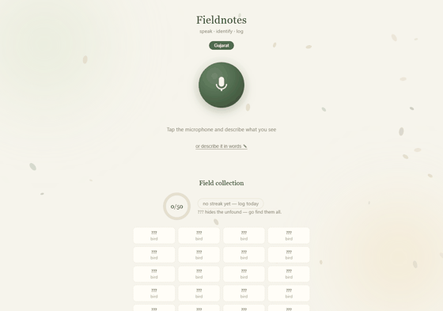
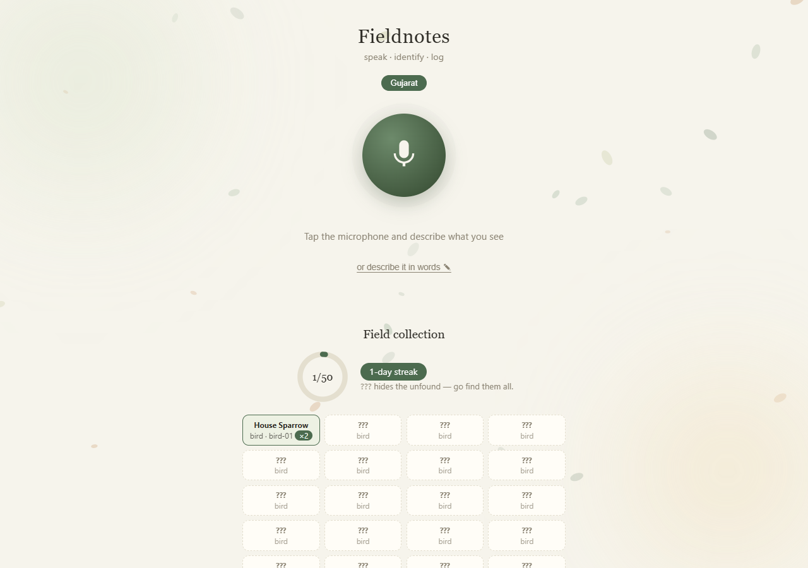
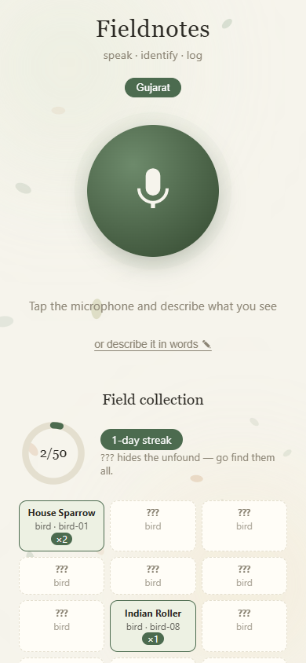

# 🌿 Fieldnotes

**An offline, voice-first nature journal.** Speak outdoors — it tells you what
you just saw. No internet, no account, no cloud.



| Desktop | Mobile |
|---|---|
|  |  |

## What it does

Fieldnotes identifies birds, plants, and insects from a spoken description and
logs each sighting to a GPS-tagged journal. The full pipeline — speech
recognition, shortlisting, and reasoning — runs on your own machine, so it
works identically with zero signal in the field.

## Design principles

- **Offline by design.** faster-whisper transcribes on-device; a local
  open-weight model (Gemma via Ollama) does the reasoning. Observations never
  leave your computer.
- **Grounded answers.** The model only ever sees a 6–8 species shortlist and
  must reply in JSON. Unknown ids are dropped and flagged as
  `grounding_violation`; flat confidences fall back to rank-based scores and are
  marked as such. The follow-up question is generated deterministically in code.
- **Installable, dependency-free frontend.** The browser UI is an offline PWA
  (manifest + service worker) served by standard-library Python — app icons
  included, generated pixel-by-pixel with no image library. Add to Home Screen
  and it runs like a native field app.
- **Location-aware.** Entries carry GPS coordinates, the app detects whether
  you are inside its covered region, and the layout adapts between mobile
  field mode and laptop.
- **Extensible.** One env var swaps the model; one JSON file adds a region.

## How it works

```
voice ──▶ faster-whisper (base.en, on-device) ──▶ transcript
                                                   │
typed text ────────────────────────────────────────┘
                                                   ▼
                         keyword shortlist (6–8 species, local data)
                           only transcript + shortlist reach the model
                                                   ▼
                         local LLM ──▶ top 3, confidence-sorted, grounding-checked
                                                   ▼
                         deterministic follow-up ("Does it have: …?")
                                                   ▼
                         confirm the sighting ──▶ journal.json (+ GPS, device, latency)
```

## Quick start

Prerequisites: Python 3.11+, [Ollama](https://ollama.com) with `gemma3:1b`
pulled, and a microphone for voice input.

```bat
python -m venv .venv
.\.venv\Scripts\python.exe -m pip install faster-whisper sounddevice numpy ollama
ollama serve
ollama pull gemma3:1b
```

**Browser app (recommended):** double-click `start-fieldnotes.bat` and keep its
window open — that window is the server. It opens `http://127.0.0.1:8765`:
tap the mic and speak, or expand *"or describe it in words"* to type, then tap
the match (or *None of these*). On a phone, use Add to Home Screen. A red
*Server unreachable* banner means the server window was closed — restart it
and hit Retry. Microphones require localhost or HTTPS, which this setup
satisfies.

**Terminal:**

```bat
.\.venv\Scripts\python.exe fieldnotes.py listen --region gujarat
.\.venv\Scripts\python.exe fieldnotes.py text "green parrot with red beak" --region gujarat
.\.venv\Scripts\python.exe fieldnotes.py stats
.\.venv\Scripts\python.exe -m unittest -v
```

`--region` selects `data/species_<region>.json` (`FIELDNOTES_REGION` fallback,
default `gujarat`); `FIELDNOTES_MODEL` selects the Ollama model
(default `gemma3:1b`). `stats` reports top-1 / top-3 / shortlist-coverage hit
rates alongside grounding violations.

## Project layout

```
fieldnotes.py             identification engine: scoring, grounding, confidence,
                          follow-up ranking, journal
app.py                    web UI + JSON API: voice upload, PWA assets, GPS/device
                          capture, collection and streak tracking
start-fieldnotes.bat      launcher for the browser app
data/species_gujarat.json 50 Surat-area birds, plants, and insects
test_fieldnotes.py        unit tests: scoring, grounding, regions, follow-up,
                          confidence fallback, ranking
docs/                     screenshots and demo GIF
journal.json              sightings log, created on first save (git-ignored)
```
